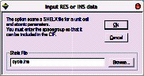
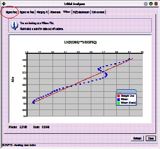
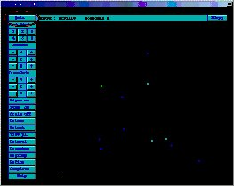
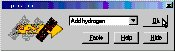

.. toctree::
   :maxdepth: 1
   :caption: Contents:

   
***************
Worked examples
***************

Worked examples.

====================================
Cyclo - a routine structure analysis
====================================

This natty material was supplied as very poor colourless crystals found congealed 
in the bottom of a half-abandoned flask.

A fragment of crystal (0.3 x 0.4 x 0.4 mm) was mounted in oil 
on a KCCD diffractometer at 190K and  a data set collected in two hours. 

The space group is P 21 21 21

.. image:: images/cyclo.jpg

-------------------
Video demonstration
-------------------

.. raw:: html

    

    <iframe width="560" height="315" src="https://www.youtube.com/embed/KDUIFE_epXE?rel=0" frameborder="0" allow="autoplay; encrypted-media" allowfullscreen></iframe>
    

	
	
--------------------------------------
Step one: Import cell and crystal data
--------------------------------------

.. image:: images/guidetool.jpg

Click the GUIDE button at the top left of the toolbar.

The GUIDE provides a list of options. To carry out the current 
recommended action you would just click OK. You can change the 
action by clicking the little arrow to the right of where it says 
“Run KCCDIN”, and choosing a new action from the list.

Change the action from "Run KCCDIN" to "Import SHELX file (ins,res)". 
Click OK on the GUIDE dialog to import the SHELX data file.

Click "Browse" and open the cyclo.ins file, then click OK.

.. image:: images/spaceinput.jpg

Enter the space group symbol. In this case, "P 21 21 21".

--------------------------------------
Step two: Import reflection data
--------------------------------------

The GUIDE will now suggest "Import reflections". 
Click OK.

Before importing reflections, CRYSTALS needs to know whether you plan to use F or F2 in the least squares minimisation. (You may change this option later).
Click No. (for now).

Find the reflection file:
Click "Browse" and open the cyclo.hkl file, then click OK.

.. image:: images/friedel.jpg

The next dialog advises you about treatment of Friedel opposites.
Read, and then click OK.

When asked "Do you want to merge the data", click Yes.

The filter reflection dialog then appears. This lets you omit reflections based on various thresholds.
Click OK to accept an
I>3 sigma(I) cutoff.

---------------------------------------------
Step three: Initial assessment of the data
---------------------------------------------

It is useful to get an idea of the
quality of your data before proceeding.

.. image:: images/initguide.jpg

The guide has moved onto the "Solve" stage, but is
recommending "Initial analyses" so that you can check the data.

Click OK.

The initial analyses window appears:

Click on each tab, and convince yourself that the data looks reasonable. 
Some of the graphs allow you to choose cut-off limits for the
data (based on :math:`I/\sigma(I)` or :math:`(\sin\theta/\lambda)^2` if you click with the
right mouse button. However, don't do this for now.

The last tab is particularly useful as it checks that the cell
contents are reasonable given the cell volume, and that the number
of observations is reasonable given the expected number of final
parameters.

Dismiss the window by clicking Close at the bottom right.

-----------------------------
Step four: Structure solution
-----------------------------

The guide should now be recommending Run Sir92.

Click OK

.. image:: images/sirini.jpg

There are four preset jobs for Sir92. Usually the
default method will work.

SIR 92 should solve the structure in under a minute,
depending on the processor speed of your machine.
Click the "Quit" button (top left) twice to close down SIR.

.. image:: images/sirimp.jpg

Click Yes to import SIR's solution back into CRYSTALS.

Click Yes.

The atoms will be numbered, so that as far as possible, adjacent
atoms have sequential serial numbers.

--------------------------------------
Step five: Check atom types
--------------------------------------

You will see that the GUIDE is now recommending "Refine posn and aniso",
but first we need to sort out the structure using the graphical model
interface.

Change the types of the two incorrect atoms so that the model
matches the expected chemical diagram (see top of page for chemical
diagram).

To rotate the structure:

Point into some empty space, hold down the left-mouse
button and drag the mouse around.

To change an element:

Point at the incorrect atom with your mouse. Press the
right-mouse button. Move the pointer down to
"Change type", and then choose the new element
type from the sub-menu:

.. image:: images/rename.jpg

Make sure the model matches the expected structure before continuing.

--------------------------------------
Step six: Commence refinement...
--------------------------------------

You may wish to change the model style from Ball to
Ellipse so that you can see how the anisotropic temperature
factors are behaving as the structure refines.

To do this click the Ellipse button on the toolbar above the model:

.. image:: images/ballelli.jpg

The guide is recommending refinement. (Refn posn and aniso)

Click OK to start.

Click OK to set up the least squares directives as specified.

Refinement will start automatically (unless you check the Advanced
box, in which case you can edit the directives and choose the number
of cycles).

CRYSTALS will carry out some rounds of refinement, the R-factor
should drop to somewhere around 8%:

.. image:: images/infotabs.jpg

--------------------------------------
Step seven: Adding Hydrogen Atoms
--------------------------------------

The GUIDE has decided that it is time to add hydrogen atoms.

Click OK to do this.

White atoms: Geometrically placed H

Pink atoms: Difference Fourier map H

.. image:: images/addhpic.jpg

You can see that in general the hydrogen atoms have been
computed correctly (co-incident white and pink atoms), but that
there is still a hydrogen missing from the Nitrogen atom.
(The double C=N bond is an artefact of the number of
Q peaks bonded to the neighbouring C atom -
it will go away in a minute!)

There is still one H atom missing. Click Continue.

Follow the GUIDE, it will recommend more refinement, then
Add Hydrogen again.

This time the missing hydrogen atom will be found in the
Fourier map. It is currently labelled QH(1). Using the right-click
method from step five, change the element type to Hydrogen.

Check the box that says "All H atoms have been found".

Click Continue.

-----------------------------------------
Step eight: More refinement & Extinction
-----------------------------------------

Carry out some more refinement by clicking OK on the GUIDE.

This time, the refinement setup offers a choice of how to
treat the H atoms:

.. image:: images/lsqsetup2.jpg

Either leave the H's unrefined (fixed) or Ride them.

Set up and carry out the refinement by clicking OK.

Next the GUIDE recommends an extinction check:

Click OK

The extinction check graph is displayed:

.. image:: images/fovsfc.jpg

It plots Fo against Fc. If extinction is a problem for the
crystal, the graph will flatten out (drop under the blue Fo=Fc
line) at high values of Fc.

Extinction isn't a problem here, however, two of the reflections
are clearly outliers.

Remove the outliers by right-clicking on the offending points and
choosing "Omit".

FYI: Likely cause - beam trap partially obscuring the image on the
diffractometer - now fixed!

Click the "Do not" button to close the window and continue without
an extinction correction.

------------------------------------------
Step nine: Choose a nice weighting scheme
------------------------------------------

Carry out one more cycle of refinement to account for the reflections
just omitted.

We now have an opportunity to pick an optimal weighting scheme.
The GUIDE recommends "Optimise Weights"

Click OK

This dialog lets us choose between calculated and statistical weights:

.. image:: images/scheme.jpg

We will go with calculated for the time being. (Assumption: the
model is more or less correct, therefore the residual gives a good estimate
of any errors - let's fit a function to it.)

Make sure the Optimal is selected in the list, then click OK.

Read the information and pick a function to use for weights:

.. image:: images/chebychev.jpg

In this case the 3 parameter calculated scheme is fine:

Click Use 3 parameter scheme.

--------------------------------------
Step ten: Validation and CIF archival.
--------------------------------------

Click OK on the GUIDE to carry out a few last cycles of refinement.

The GUIDE now recommends "Validate" (this means that it's happy that
the structure is complete).

Click OK to validate the structure.

A list of tests and any failures will
appear in the text window on the left:

If the shift/esd is causing a warning then:

Change the GUIDE default option to Refine posn and aniso and click OK.

	

Then carry out the validation again.

This time, there should be no problems with the structure.

If all checks passed, the GUIDE will recommend Publish.

In any case, ensure that Publish is the selected option in the
GUIDE and click OK.

.. image:: images/tidyup.jpg

When asked if you want 6 final cycles of least squares, click Yes.

A variety of data formats are available for publication/archiving.

Choose CIF, which contains just about everything that you need.

Click OK to write a CIF.

Open the CIF for editing if you want to. Close the Publish dialog.

From the menus choose "Results"->"Checkcif on the web" for further
checks.

The cif is c:\\wincrys\\demo\\cyclo\\publish.cif.

To close CRYSTALS choose Exit Crystals from the File menu.

Alternatively, to get back to the workshop starting point,
choose Demo from the Help menu.

==================================
Poor Quality Data - Tetraphenylene
==================================

----------
Background
----------

This is a hard, well crystalline organic material. Melting point 232-235 C.
The crystals are in the form of prisms terminated with brilliant pyramidal
faces. It was selected as a potential test crystal for analysing data
collection and processing strategies, since its internal symmetry
permits non-crystallographic statistical tests to be applied.  A
crystal 0.04 x 0.05 x 0.17 mm was Araldited to a fine glass capilliary.
A hemisphere of data was collected using the parameter settings selected
by the Nonius COLLECT software.  Further equivalent data sets were collected
with exposure times doubled, halved and quartered.

The data we have here is for the very fast data collection.
The full hemisphere of data took 48 minutes to collect (15519
reflections).  The average redundancy is 3, with 4000 reflections having
a redundancy of 5 or more.

Chemical formula C24 H16,  Space group monoclinic C2/c.

---------------------
Analysis and solution
---------------------

Get started as in Exercise 1, with the following differences:
::

   This time:
          Choose the workshop structure "Quick"
          the SHELX format input file is called veryfast.ins 
          choose F2 refinement instead of F. (Click Yes).
          the reflection file is called veryfast.hkl
          when the filter dialogue opens, change the minimum
               I/sigma(I) from 3.0 to -10.0 (i.e. only reject
               very negative data).

Foolishly ignore the "Initial analysis" selection, then solve
the structure with SIR92, using the default settings.
It will not be very successful.

Quit SIR, and when asked do not use the solution from Sir92.
Close the advice dialog that follows.

Now re-select the "Initial Analysis" option in the GUIDE. (OK)

There may be a few moments delay while the systematic absences
are loaded.

Select the "Absences" tab - you should see that they are
fairly symmetrically distributed about 0,0.

Select "Sigma freq." - you will see that there are only about 500
reflections with I>3sigma(I).

Select "Wilson Plot" - the high-angle data don't make any sense. 

Right-click a blue cross on the Wilson plot somewhere near
:math:`\rho`, (:math:`=(\sin\theta/\lambda)^2`) = 0.35. Then click the "Reject data"
menu item that pops up.

In the filter dialogue, round the :math:`(\sin\theta/\lambda)^2` upper limit
to exactly 0.35.

Close this dialogue, close the Initial Analyses window and then
re-run SIR92, but this time click the radio-button that says "Filter
Reflections using List28 conditions".

The structure should now solve.

Note that setting a minimum I/sigma(I) threshold instead of a
resolution threshold will not help solve the structure.  This
is because while high-angle weak reflections are just noise,
low angle weak reflections have high information content and
are needed for the negative quartets.

---------------------
Refinement
---------------------

The Guide will now invite you to perform Isotropic refinement.

Try it.  

Because of the high R factor, the Guide will not advance past
isotropic refinement.

Force anisotropic refinement.  

There is little improvement in R, but if you enable ellipses
in the model window they look fair.

Now choose "Filter Reflections" from the "Refinement" menu.

Change the I/sigma(I) threshold from -10.0 to 3.0, and then try
some aniso refinement.

The R factor will be quite small, but in the Refinement summary
tab, you will see that there are less than 3 reflections per parameter!

Accept the GUIDE's invitation to Add Hydrogen atoms.  

You should see that the ones found in the difference map are reasonably
near to the predicted positions.

Select more anisotropic refinement, but in the dialog box, also
enable hydrogen position refinement.

You now have a stable refinement with no restraints yet an
observation:parameter ratio of little over two.

------------------------
But what of the e.s.d's?
------------------------

Type the following into the CRYSTALS command line box (below
the information tabs):

::

   \DIST
   E.S.D. YES
   END

Each of the bond lengths will be listed, with its associated e.s.d.

There will be an optimum I/sigma(I) cutoff and weighting scheme
to minimize the e.s.d's:
::

   Cutoff too high => not enough data.
   Cutoff too low	=> too much noise.

You can use the reflection filter dialogue box to experiment with
different filters, and use the optimise weights dialogue to experiment
with weighting.

===============
Spacegroup Quiz
===============

From the Development menu, choose Space group quiz.

