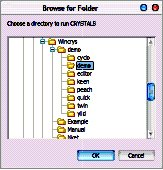
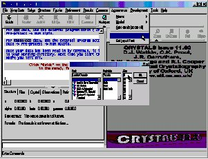
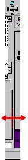

.. toctree::
   :maxdepth: 1
   :caption: Contents:

   
***************
Getting Started
***************

====================
Organisation of data
====================

CRYSTALS stores information in a single document (default name crfilev2.dsc) within a folder. Many 
other output and intermediate files are written to this folder.

====================
Starting the program
====================

*Method 1* Double click on the CRYSTALS icon on the desktop, the "Browse for Folder" dialog 
will be displayed. The selected directory should already be demo, if it isn't then 
browse to find it: c:\\wincrys\\demo\\demo, highlight it and then click OK.

*Method 2* If you have already started a project, double click on the crystals database file to launch
CRYSTALS and open that file.

*Method 3* Right-click on any folder, or within a folder, and choose 'Open CRYSTALS here' from the popup menu.

CRYSTALS will start, and the demo / workshop dialog will open automatically.

.. image:: images/demodialog.jpg

Choose Cyclo from the list of workshop structures and click "Open workshop structure".

We will use this starting point throughout the workshop to choose different starting structures. 
To bring this dialog either close and restart CRYSTALS, or choose "Demo" from the "Help" menu.

=============================================
Customising CRYSTALS to suit your screen size
=============================================

It is important to be able to read the text output in the left hand pane of the CRYSTALS window.

From the menus choose "Appearance"->"Set Text Font"
Choose the smallest font size that you can read.

I would recommend Lucida Console in size 7.

Now make sure that you can see the full width of a line of text in the output pane.
You can drag the bar situated between the text area on the left and the CRYSTALS logo 
screen on the right, to adjust the relative sizes of these two areas.

The area on the right will eventually display a representation of the atomic co-ordinates, 
so leave it at least a little bit of space.

