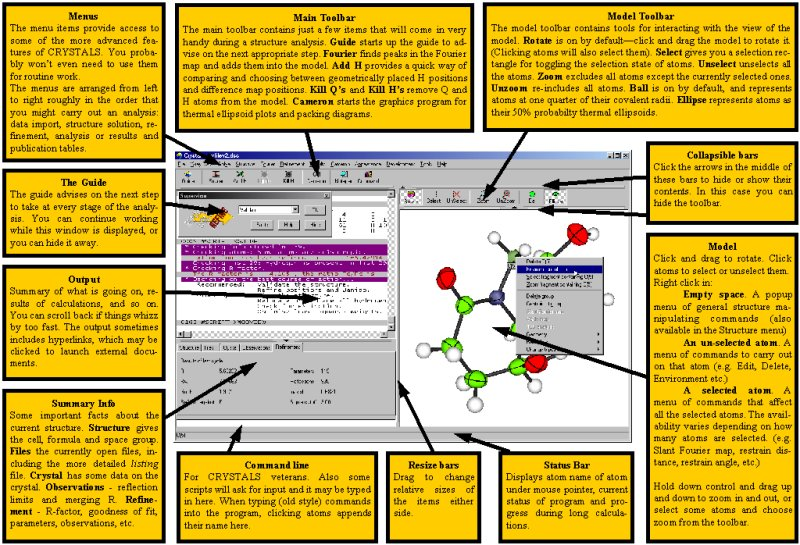

.. toctree::
   :maxdepth: 1
   :caption: Contents:

   
**************
User Interface
**************

.. index:: GUI overview

========================================
Overview of the graphical user interface
========================================

*********
The Menus
*********

.. index:: GUI menus

====
File
====

---------------
New Working Dir
---------------

   
   Choosing this item will display a dialog box allowing you to choose
   a new folder to work in. The current dsc file will be closed, and the
   working folder will change to the new one. If the new folder contains
   an existing crfilev2.dsc, this will be opened.
   
   

-------------
Open Datafile
-------------

   
   Choose this item to open a new CRYSTALS dsc file. The current dsc
   file will be closed, and the new one opened. The working directory
   will change to the folder containing the new dsc file.
   
   

-------------
Save Datafile
-------------

   
   No action will be taken. The DSC file is constantly updated as operations
   are carried out in CRYSTALS, so there is no need to 'save' the current state.
   
   

----------------
Save Datafile As
----------------

   
   A dialog box will allow you to choose a filename to save a copy of the
   current dsc file. After the copy has been saved, the current dsc file is
   closed, and the new copy is opened.
   
   

--------------------------------
Open Instruction File (USE file)
--------------------------------

   
   Cause CRYSTALS to execute (USE) a pre-prepared text file containing 
   CRYSTALS commands and/or data lists
   
   

-------------
Exit Crystals
-------------

   
   Closes the program.
   

==========
X-ray data
==========

The X-ray data menu is concerned with the input, export or editing of 
experimental X-ray observations and data.

-------------
Guided Import
-------------

   
   Starts up "The Guide".
   
   The Guide tries to suggest a strategy for working with 'routine' 
   structures.
   
   

-------------------
Diffractometer cifs
-------------------

   
   Submenu. See section :ref:`Preprocess`.

-----------------
Use Pre-processed
-----------------

   
   Submenu. See Section :ref:`Use`
   

------------------------------
Import Shelx file (INS or RES)
------------------------------

   
   Opens a dialog to help import SHELX .ins or .res files. Choose the
   file name. You will need to know the space group symbol.

-----------------
Import HKLF4 data
-----------------

   
   Opens a dialog which allows the import of reflection data in a variety
   of formats, most commonly, SHELX HKLF4 format.
   
   

-----------------
Import HKLF5 data
-----------------

   
   Converts a Shelx HKLF5 file into CRYSTALS format. Gives the 
   opportunity to enter the twin law matrices
   
   
   
   

------------------
Import "cif" files
------------------

   
   Opens a dialog which allows the import of data from "cif"  and "fcf" 
   files.

   
   If the "cif" file contains more than one structure, the data from 
   each may either be put into separate CRYSTALS format files, or into one
   single file. If there is a single file, it can be imported directly into
   CRYSTALS.  If the "cif" file contians a Z'=2 structure, the two 
   molecules can be 'matched', ie tested for similarity.
   

---------------
Input/Edit Cell
---------------

   
   Displays a dialog box for inputing or editing the cell parameters and
   their associated standard uncertainties.

---------------------
Input/Edit SpaceGroup
---------------------

   
   Displays a dialog box for entering the space group symbol. It may
   either be hand-typed, in which case there must be a space between each
   operator, or it may be selected from a list of the most common settings
   of every space group.
   
   

------------------------
Input/Edit Cell Contents
------------------------

   
   Displays a dialog box for entering the type and number of every element
   present in the unit cell.
   
   
   

-----------
File Export
-----------

   
   Enables the creation of text files in various formats
   

------------------
Filter reflections
------------------

   
   Allows filters to be specified for rejecting certain categories of
   reflections. If no filters are present, the dialog will offer a default
   of rejecting reflections where I/sigma(I)<3.0 and also some very low angle
   reflections.
   

------------
Edit goodies
------------

   
   Allows editing of the 'goodies' - lots of information that is required
   for a useful CIF is stored here. This dialog provides a convenient way
   to view and edit it.
   

----------------
View Reflections
----------------

   
   This item will write the current list of reflections to a file and open
   that file for you to inspect them.
   
   

.. _Preprocess:

 
===================
Diffractometer cifs
===================

The Generalised input tries to get the information for a final 
structural cif from the instrument output. It prompts the user for 
things it needs but cannot find (e.g. colour, size).  Take care when 
processing H-M space group symbols. Some instruments only out put
the Laue group as a space group, other use a syntax which cannot be 
parsed. Also, check the structural formula has been unpicked correctly.
The selection by instrument type is to enable CRYSTALS to enter
the correct details into the final ciff.
Try the WinGX option if your instrument is not listed, but remember to 
use "Edit Cif Goodies" to manually set the instrument type.

--------------------------
Run Generalised cif input 
--------------------------

   
   May eventually replace other options listed below.
   

---------------------------------------
Run Agilentin (Oxford Diffraction data)
---------------------------------------

   
   Agelentin in processes Oxford Diffraction data.
   

----------------------
Run KccdIn (Kccd data)
----------------------

   
   KccdIn takes an import.cif file, generated by Nonius Kappa CCD
   diffractomer software and produces input files suitable for reading
   into Crystals.

--------------------
Run RC93 (Cad4 data)
--------------------

   
   RC93 takes cpd.dat and cpd.psi files, generated by Nonius CAD 4
   diffractomer software and produces input files suitable for reading
   into Crystals.

------------------------
Run DipIn (DIP2000 data)
------------------------

   
   RC93 takes reflection and listing files, generated by DIP2000
   diffractomer software and produces input files suitable for reading
   into Crystals.
   

.. _Use:

 
========================
Input Pre-processed data
========================

-----------------
Use KCCDIN output
-----------------

   
   Reads in CRYSTALS format data files produced by the KCCDIN program
   

---------------
Use RC93 output
---------------

   
   Reads in CRYSTALS format data files produced by the RC93 program
   

----------------
Use DIPIN output
----------------

   
   Reads in CRYSTALS format data files produced by the DIPIN program
   
   
   
   
   

=====
Solve
=====

.. _undo:

 
=========
Structure
=========

----
Undo
----

   

   
   Allows you to step back to any previous model (List 5) stored in the DSC
   file. All models are stored unless you PURGE the DSC datafile, or
   explicitly delete them using this dialog.

   
   Note: If you use the GUIDE, and automatic purge occurs after you have
   checked for extinction - any models marked explicilty as 'to be retained'
   will not be PURGED.
   
   

=======
Fourier
=======

==========
Refinement
==========

=======
Results
=======

--------------
Likely H-bonds
--------------

   
   Finds all X--H distances (X=O or N) where the bond distance falls between
   1.5 and 2.2 Angstroms. Also lists the X-H--X angles so that you can decide
   if the X--H is an acceptable hydrogen bond.
   

------------------
Agreement analysis
------------------

   
   Displays graphs of four different analyses of variance.
   
   

---------------
Difabs analysis
---------------

   
   Creates a contour map of the difabs absorption correction that WOULD BE
   applied if you were to run DIFABS. The flatter the map the better.
   
   

--------------------
Rotax analysis/twins
--------------------

   
   Submenu, see section :ref:`rotax`
   

----------------
Edit CIF goodies
----------------

   
   Allows you to edit some of the values that will be put in the final CIF
   
   
   

------------------
Publication tables
------------------

   Allows you to output data in a variety of ways. CIF is probably the most
   commonly used format. Please note that the standard uncertainties output
   in CIF files follow the 'Rule of 19', as requested by *Acta Cryst*:

   
   What it means is as follows....
   ::

      SU values are quoted to two digits precision if they are <= 19.
      E.g.
      rule of 9:    5.548(1)   1.453(2)    3.921(3)    1.2287(8)
      rule of 19:   5.5483(9)  1.4532(16)  3.921(3)    1.2287(8)
      rule of 29:   5.5483(9)  1.4532(16)  3.9214(29)  1.2287(9)
   

   

   
   The object of this approach is to provide a more consistent distribution
   of precision across all values. 
   

------------
Summary file
------------

   
   Produces a human-readable summary file of the crystal structure
   
   

-----------
Acta checks
-----------

   
   Performs some basic validation checks on a complete or almost complete
   structure, to try to catch any problems remaining.
   
   

-------------------
Checkcif on the web
-------------------

   
   Just a link to the IUCr cif checking website.
   
   

------
Platon
------

   
   Writes files for and runs Platon, if you haven't run it before, you
   will be asked to browse for the PLATON.EXE file on your hard disk.
   
   

.. _rotax:

 
================
Results -> Rotax
================

-----
ROTAX
-----

   
   Runs the Rotax procedure for looking for twin-laws. Output consists
   of a selection of possible twin laws with associated figures-of-merit.
   Figures closer to zero are best, but beware figures of exactly zero
   (corresponding to exact lattice overlap), since they are probably just
   part of the point group symmetry of your structure.

   
   You may choose a twin law to be applied
   
   

-----------------------
Input twinned structure
-----------------------

   
   Allows you to give a known twin-law. The ROTAX option above is probably
   easier to use, even if you already know the twin law.
   
   

----------------
Remove twin laws
----------------

   
   Removes the twin laws (List 25), removes the twin scales from the model
   (List 5) and reverts to the original reflection listing. (Saved during
   the application of the twin-law).
   
   

========
Graphics
========

----------------
Cameron Graphics
----------------

   
   Starts Cameron, a program for visualising crystals structure packing and
   producing publication diagrams
   
   

-------
Special
-------

   
   Submenu. See section :ref:`specialgraphics`.
   

--------------------------
Import last Cameron output
--------------------------

   
   Reads in the model which Cameron wrote at the end of its last run.
   Could be useful if you've trashed the model since then (although, see also:
   Structure -> Undo, section :ref:`undo`).
   

-------------------------
Import last Cameron input
-------------------------

   
   Reads in the model which CRYSTALS last wrote to send to Cameron.
   Could be useful if you trashed the model in Cameron and then accidentally
   brought it back into CRYSTALS. (Although, see also:
   Structure -> Undo, section :ref:`undo`).
   

---------
Mapviewer
---------

   
   Enables you to re-display maps created by a previous Slant or Voids 
   calculation.
   
   

.. _specialgraphics:

 
===================
Graphics -> Special
===================

----------------------------------
Cameron (use existing input files)
----------------------------------

   
   Starts Cameron without writing new input files for it. Useful if you
   have an external program that produces cameron.ini and cameron.l5i files.
   

==========
Appearance
==========

-----
Atoms
-----

   
   Submenu. See section :ref:`atoms`.
   

-----
Model
-----

   
   Submenu. See section :ref:`model`.
   

---------------------
Auto scale (zoom off)
---------------------

   
   Restores the model to its original view, if it has been zoomed.
   
   

-------------
Set Text Font
-------------

   
   Allows you to choose a font for the text output window. I recommend
   Lucida Console, or Courier - in any case use a fixed/monospaced font,
   otherwise the output of tables will not make much sense.
   

--------------
Set Input Font
--------------

   
   Lets you choose a font for the input editbox. Might be useful if
   you are demonstrating command line features on a high-res screen.
   
   
   

.. _atoms:

 
===================
Appearance -> Atoms
===================

--------
Covalent
--------

   
   Sets radius of atoms displayed in the main model window to be 1/4 of
   their covalent radius.
   

-------------
Van der Walls
-------------

   
   Sets the radius of atoms displayed in the main model window to be
   the VDW radius.
   

-------
Thermal
-------

   
   Displays atoms as either ellipse representation of ADPs, or sphere
   representing U[iso].
   

------------
Quarter size
------------

   
   Set radius to 1/4 of given value (either covalent, vdw or thermal).
   

---------
Half size
---------

   
   Set radius to 1/2 of given value (either covalent, vdw or thermal).
   

---------
Full size
---------

   
   Set radius to given value (either covalent, vdw or thermal).
   
   

.. _model:

 
===================
Appearance -> Model
===================

------------
Update model
------------

   
   If automatic update is disabled, this command updates the model
   

---------------
Auto update OFF
---------------

   
   Disables auto update. Useful for big structures where the drawing is
   significantly slowing the program
   

--------------
Auto update ON
--------------

   
   Enables auto update of the model window.
   

-------------
Set wallpaper
-------------

   
   Experimental feature. Allows you to set the background of the model
   window with a bitmap. The bitmap is stretched or shrunk to fit the window.
   Significantly slows the drawing on slower machines. Also, the width of
   the bitmap in pixels must be a multiple of 4.
   

------------
No wallpaper
------------

   
   Removes the model background if present
   
   
   

===========
Development
===========

This menu contains items that are currently under development. They
are not documented yet, and you should not need to use them. If you
wish to experiment, please make a copy of your structure and experiment
on the copy. Feedback is welcome.

